# Synthetic Dataset Generator by Bughao Lab

A browser-based tool that turns documents, web pages, ebooks, spreadsheets, and source code into fine-tuning Q&A pairs using the LLM provider of your choice.

Point it at a file, a whole folder, a website, or a Google Drive / OneDrive folder — then review the results and export in the schema your training stack expects. Everything runs in the browser; there is no backend.

   

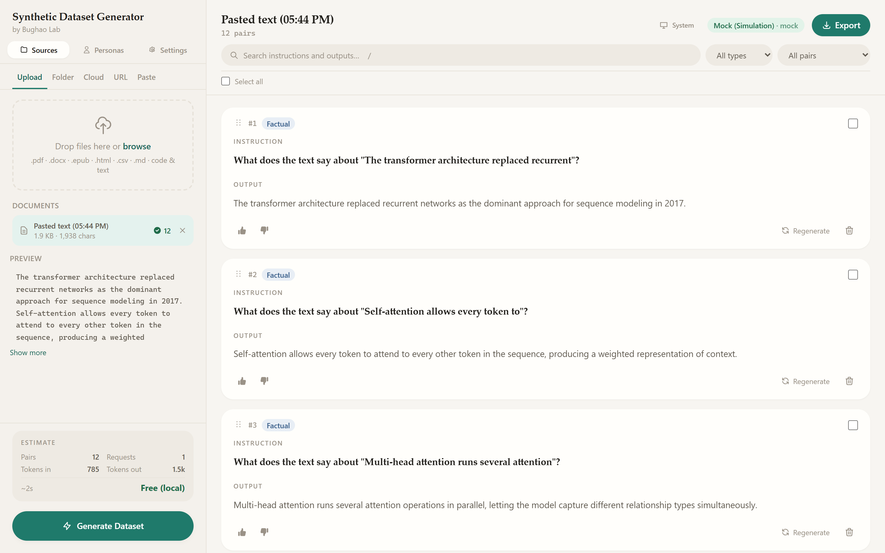

<details>
<summary><b>Dark mode</b> — click to expand</summary>

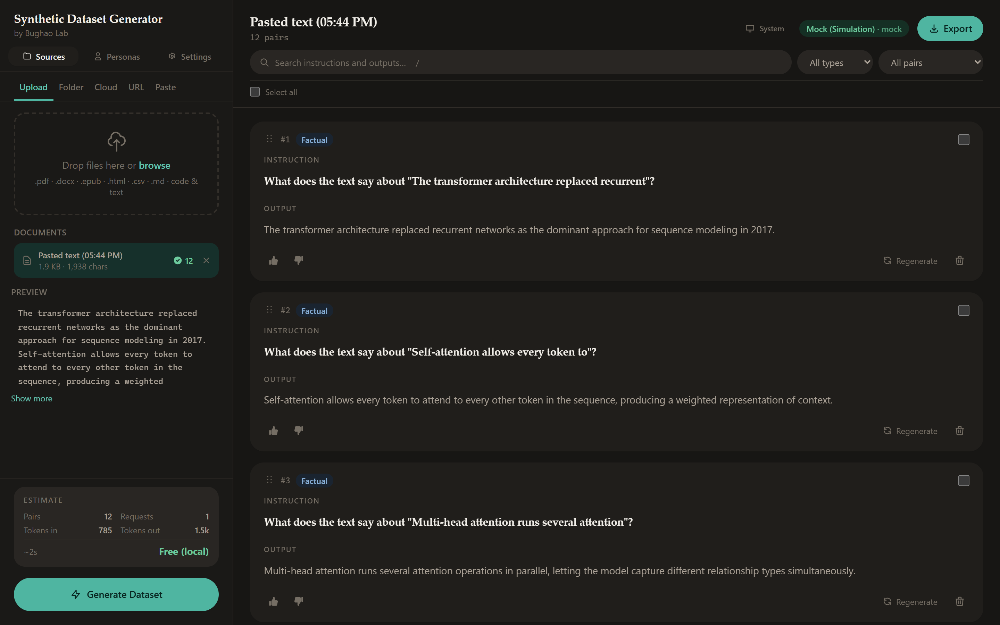

</details>

---

## What it does

ML practitioners spend hours hand-labeling training data. This tool automates that by:

1. Gathering your source material — from a file, a folder tree, a website, a cloud drive, or the clipboard
2. Splitting long documents into overlapping chunks so nothing is truncated away
3. Sending every chunk to an LLM in parallel with a structured prompt that demands clean JSON
4. Rendering each Q&A pair as an editable card you can review, search, rate, and reorder
5. Exporting in Instruction, ChatML, Alpaca, or ShareGPT schema — with an optional train/validation split

Everything runs in the browser. No backend server, no data leaves your machine except the API calls you authorize.

Bulk sources — folder, crawl, and cloud — all pass through a **review step** that shows what was found, what was excluded and why, and what generating from the selection would cost, before anything is imported.

---

## Features

### Getting material in

| Source | What it does |
|---|---|
| **Upload** | One or more individual files |
| **Folder** | A whole folder including every subfolder, reviewed before import |
| **Cloud** | A folder from a connected Google Drive or OneDrive account |
| **URL** | Fetches a page, or crawls a site's links, and extracts readable text |
| **Paste** | Raw text straight into the box |

Every source ends up producing the same thing — a file handed to the same
reader — so all 68 formats below work from any of them, and chunking,
generation, dedup, quality checks and export behave identically regardless of
where the material came from.

#### Folder import

Selecting a folder walks every subfolder and opens a review step before
anything is imported — you see what was found, what was excluded and why, and
what generating from the selection would cost.

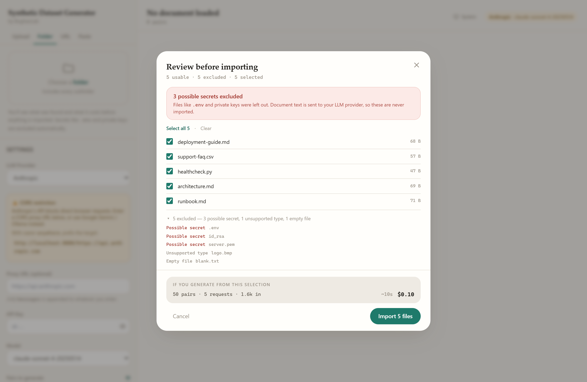

Excluded automatically, and reported rather than hidden:

- **Possible secrets** — `.env*`, private keys, `credentials.json`, `.pem`/`.p12`/`.key`, anything under `.ssh/` or `.aws/`
- **Build and VCS noise** — `.git/`, `node_modules/`, `dist/`, `__pycache__/`, and similar
- **Unsupported types**, **empty files**, and anything over 5 MB

> Document text is sent to your LLM provider. Excluding secrets by default is
> what stops a folder import from becoming a credential leak — which is why
> secrets are never selectable, not merely unchecked.

Large folders arrive with the first 200 files selected rather than all of them,
so a repository with thousands of files does not silently queue an expensive run.

#### URL import

Fetches the page through the dev CORS proxy and runs it through the normal
reader, so HTML, PDF, Markdown, CSV, JSON and Office documents all work. HTML
has navigation, scripts and chrome stripped before the text is kept.

> URL import needs the dev server's CORS proxy. In a static production build
> `proxyFetch` falls back to a direct request, which most origins refuse — so
> this source works under `npm run dev` unless you host a proxy alongside the app.

#### Crawling a site

Tick **Also follow links on this page** to turn one URL into a corpus. The
crawl is deliberately bounded, because the requests land on someone else's
server:

- **Same-origin only** — external links, `mailto:` and `tel:` are never followed
- **Depth 1 or 2**, with a hard page cap (10 / 25 / 50 / 100)
- **One request at a time**, with a pause between them
- **`robots.txt` honoured** — the `User-agent: *` group, longest match wins
- **`noindex` respected** — the page is not imported, though its links still map the site
- **URLs deduped** by stripping fragments and tracking params, sorting query
  keys, and treating `/docs` and `/docs/` as one page, so a cycle terminates
  instead of running to the cap

Linked PDFs, CSVs and other readable documents are imported too, but are not
crawled into. Everything found goes through the same review gate as a folder,
so you see what was skipped and what generating would cost before importing.

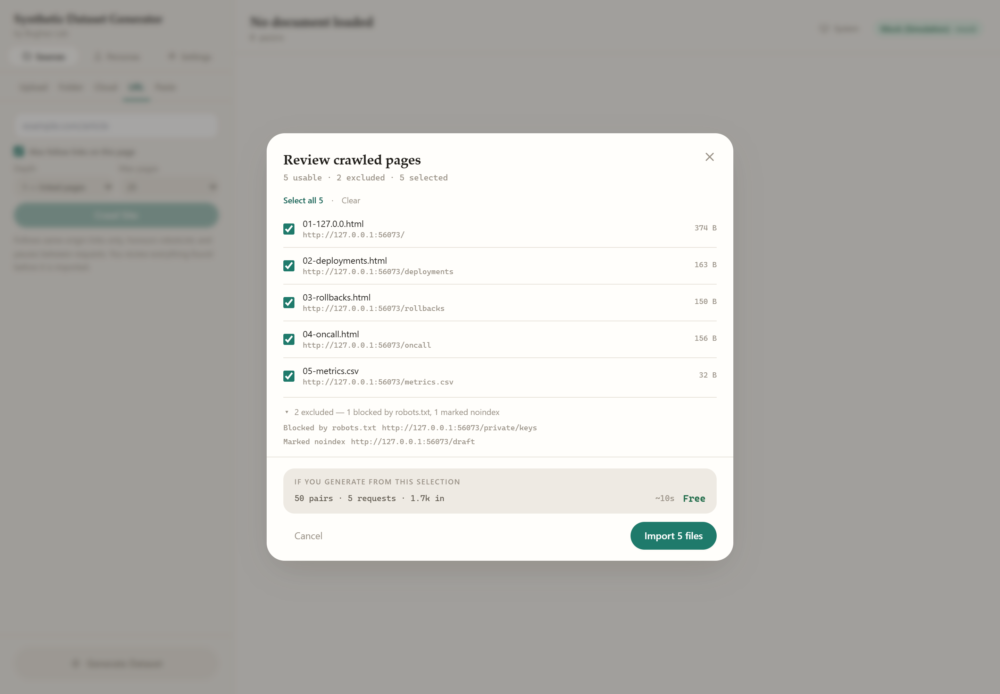

#### Connecting Google Drive and OneDrive

Both are connected from **Settings → Cloud sources**. Each deployment supplies
its own OAuth client ID: client IDs are tied to the origin they run on, so one
cannot ship with the app.

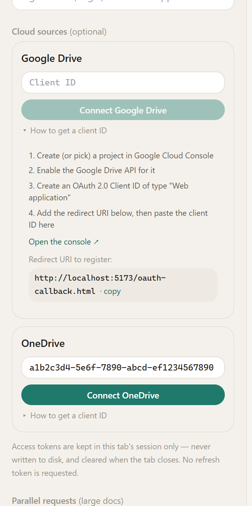

| | Google Drive | OneDrive |
|---|---|---|
| Register at | [Google Cloud Console](https://console.cloud.google.com/apis/credentials) | [Microsoft Entra ID](https://portal.azure.com) |
| App type | Web application | Single-page application |
| Also needs | Google Drive API enabled | — |
| Scopes requested | `drive.readonly`, `openid`, `email` | `Files.Read`, `User.Read` |

Add the redirect URI shown in the panel (`<your-origin>/oauth-callback.html`)
to the app registration, paste the client ID, and click Connect.

**How the sign-in works.** Authorization Code with PKCE, in a popup — no
Google Identity Services or MSAL bundle, and no client secret, which a browser
app could not keep anyway. The popup lands on a static callback page that
posts the authorization code back to its opener at an exact origin and closes;
the code is exchanged for a token by the app itself.

- Tokens live in **`sessionStorage`** — never on disk, cleared when the tab closes
- **No refresh token is requested** (no `offline_access`): a long-lived credential has nowhere safe to live in a browser
- `state` is verified on return, and messages from any other origin or source are ignored
- Expired tokens are purged on read, and a `401` clears the session and asks you to sign in again

**Importing.** Once an account is connected, the **Cloud** tab lists folders
from it. Subfolders are included, and listing is metadata only — nothing is
downloaded until you confirm in the review step, so browsing a large Drive
costs nothing.

- **Google Drive** — paste a folder link or ID. Native formats are exported on
  the way out, since Docs, Sheets and Slides are not files and cannot be
  downloaded directly: Docs and Slides become plain text, Sheets become CSV,
  which then flows into the row-aware CSV reader. Everything else downloads
  verbatim.
- **OneDrive** — paste a folder share link, or leave the box empty for your
  whole drive. No export step is needed: Office files download as `.docx`,
  `.xlsx` and `.pptx`, which the app already parses. Downloads use Graph's
  pre-signed URL, which must *not* carry the bearer token.

The same exclusion rules apply as for a local folder — a Drive can hold a
`.env` too.

#### Supported formats

| Category | Formats |
|---|---|
| **Documents** | `.pdf` `.docx` `.epub` `.pptx` |
| **Text & prose** | `.txt` `.md` `.rst` `.adoc` `.tex` `.org` |
| **Markup** | `.html` `.htm` `.xhtml` `.xml` |
| **Tabular** | `.csv` `.tsv` |
| **Code** | `.py` `.js` `.ts` `.jsx` `.tsx` `.java` `.go` `.rs` `.c` `.cpp` `.cs` `.rb` `.php` `.swift` `.kt` `.scala` `.r` `.lua` `.dart` `.ex` `.clj` `.hs` … |
| **Config & data** | `.json` `.jsonl` `.yaml` `.toml` `.ini` `.sql` `.graphql` `.proto` `.sh` `.ps1` `.log` … |

- Drag-and-drop (including whole folders), file picker, folder picker, URL, or paste
- **Batch processing** — every loaded document is processed automatically, not just the active one
- Long documents are split into overlapping chunks (4,000 chars with 300-char overlap) so the full text is covered

Structured formats get format-aware handling rather than a naive text dump:

- **HTML** strips `script`, `style`, `nav`, `header`, `footer`, and other chrome, preferring `<article>`/`<main>` as the content root
- **CSV/TSV** is rendered as labelled records (`Question: …` / `Answer: …`) instead of comma soup, so the model can tell which value belongs to which column
- **EPUB** follows the OPF spine so chapters come out in reading order, not alphabetical filename order
- **PPTX** extracts per-slide text with numeric slide ordering (slide 10 after slide 2, not between 1 and 2)
- **Code** is chunked on line and block boundaries rather than sentence boundaries, since a period inside `obj.method()` is not a sentence end

If a file parses but yields no usable text — most often a **scanned PDF with no text layer** — the upload fails with a specific message telling you to OCR it, rather than silently adding an empty document that breaks generation later.

### Generation
- **Pair count** — 5 to 10,000 per document
- **Style** — Factual Q&A, Instruction-following, or both
- **Difficulty** — Basic, Intermediate, Advanced
- **Temperature** — Low (0.3), Balanced (0.7), Creative (1.0)
- **Audience persona** — write from one or more points of view (see below)
- **Domain tag** — optional label (e.g. `medical`, `legal`) injected into the prompt
- **Parallel requests** — 1 to 10 concurrent API calls, shared across all files

### Audience personas

The same document answers very different questions depending on who is asking.
A newcomer wants to know what something *is*; an auditor wants to know who
signed it off. Without a persona you get neutral, encyclopedic pairs — good for
coverage, weak for training a model that has to serve a particular audience.

Pick one or more personas and the dataset is written from their point of view —
both halves of the pair. The persona changes which questions get asked *and* how
the answers are pitched.

| Persona | Asks about |
|---|---|
| **Newcomer** | What things are, why they exist, what the terms mean |
| **Practitioner** | Exact values, correct procedure, what to do in a given case |
| **Expert** | Edge cases, trade-offs, why one approach was chosen |
| **Decision maker** | Cost, risk, timing, what happens if we do nothing |
| **Support agent** | Symptoms, fixes, what to tell the customer, when to escalate |
| **Developer** | How to call it, what the error means, expected response shape |
| **Auditor** | The rule, who is responsible, exceptions, how it is evidenced |
| **Skeptic** | Evidence, limitations, what is left unsaid, when it fails |

**Every persona is editable, and you can add your own.** Presets can be
rewritten in place — edits are stored as an override, so Reset always restores
the shipped version rather than losing it. There is also a one-off free-text
persona for a point of view you do not want to save.

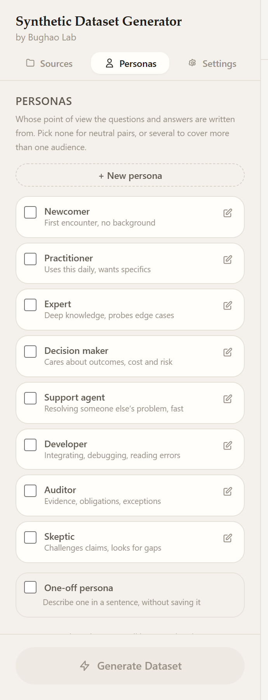

Selecting several splits the pair budget across them, and each gets its own
request per chunk so the voices stay distinct instead of blurring into an
average. Pairs are badged with their persona and can be filtered by it.

> Two guardrails are built into the prompt. Answers are written *for* the
> persona but never name them — without that, outputs start "As a developer,
> you should…", which is an artefact of the generator rather than knowledge.
> And the persona changes framing only, never the facts: everything stays
> grounded in the source text.

> More personas means more requests — three personas is three times the calls,
> since each chunk is sent once per point of view. The estimate panel accounts
> for this, so check it before a large run.

### Cost and time estimate before you commit

Every run shows what it will cost and how long it will take *before* you click Generate — chunk count, token estimates, wall time, and USD based on a per-model price table. Local providers show **Free**; runs above $5 get a warning.

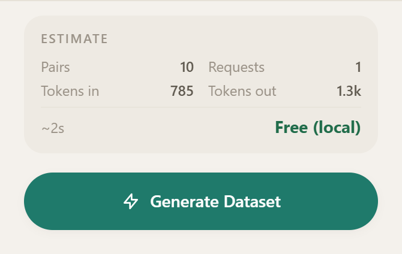

### Interface

The sidebar is split into three views — **Sources**, **Personas** and
**Settings** — rather than one long scroll. The cost estimate and the Generate
button stay pinned below all three, so the primary action is always reachable.

The UI is built on a semantic design-token system — every colour is a CSS variable, so light and dark are two sets of values rather than two sets of class names.

- **Light, dark, and system themes.** The toggle cycles between them; `system` follows the OS setting live, and the choice persists. The stored theme is applied before React mounts, so dark-mode users get no white flash on load.
- **Editorial typography.** Generated questions are set in a serif display face at a larger size, because reading and judging model output is the app's actual work. All faces are system fonts — no webfont, nothing fetched at runtime.
- **Keyboard shortcuts:**

| Shortcut | Action |
|---|---|
| `⌘/Ctrl` + `K` or `/` | Focus search |
| `⌘/Ctrl` + `Enter` | Generate |
| `⌘/Ctrl` + `E` | Open export |
| `Esc` | Close modal, or clear search |

- Visible focus rings on every interactive element, and `prefers-reduced-motion` is respected.

### Review workspace
- Editable instruction and output textareas (auto-resize)
- **Full-text search** across instructions and outputs
- Filter by type, rating, edited state, quality flags, or duplicates
- Thumbs up / down rating per pair
- Per-card regenerate
- Drag-and-drop reordering (up to 100 pairs)
- Bulk select → delete

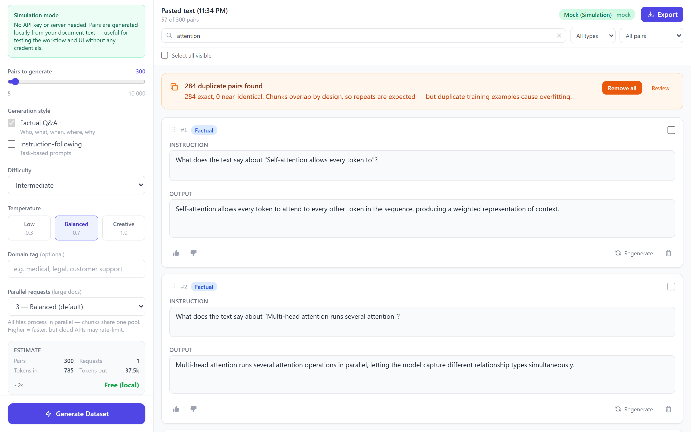

### Duplicate detection

Chunks overlap by design, so near-identical pairs are a structural certainty — and duplicate training examples cause overfitting. A two-pass scan (exact normalized match, then trigram similarity at 0.85) flags them for removal or review.


### Quality validation

Heuristic checks flag pairs likely to hurt a fine-tune — empty or truncated outputs, text that is too short, instructions echoed as answers, and answers that leak phrases like *"according to the document"* despite the prompt forbidding it. Issues appear inline on the card; nothing is deleted automatically.

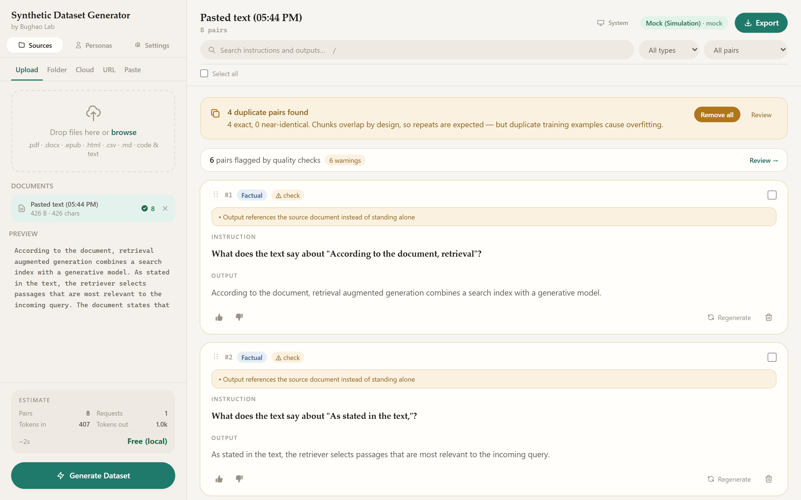

### Export

Four schemas, three file formats, and an optional deterministic train/validation split:

| Schema | Shape | Used by |
|---|---|---|
| **Instruction** | `{ instruction, output, type }` | This app's native shape |
| **ChatML** | `{ messages: [{ role, content }] }` | OpenAI, Together, Fireworks |
| **Alpaca** | `{ instruction, input, output }` | Stanford Alpaca, LLaMA-Factory |
| **ShareGPT** | `{ conversations: [{ from, value }] }` | Axolotl, Vicuna |

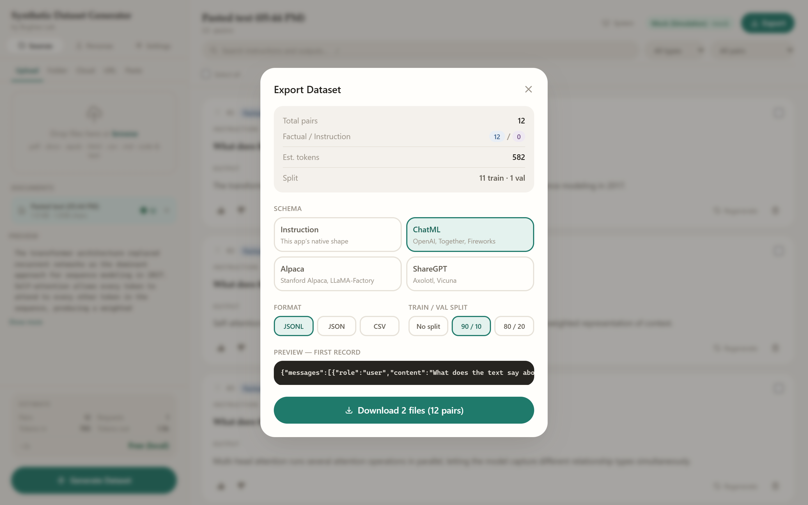

Formats: **JSONL** (fine-tuning standard), **JSON**, **CSV**. Splits: none, 90/10, or 80/20 — emitted as `_train` and `_val` files. You can also export only the pairs you have selected.

### Large output mode

Above 1,000 pairs, rendering every card would freeze the browser. The app switches to direct-to-file mode: pairs stream into a buffer that bypasses React state entirely, a live counter shows progress, and the download fires when generation completes.

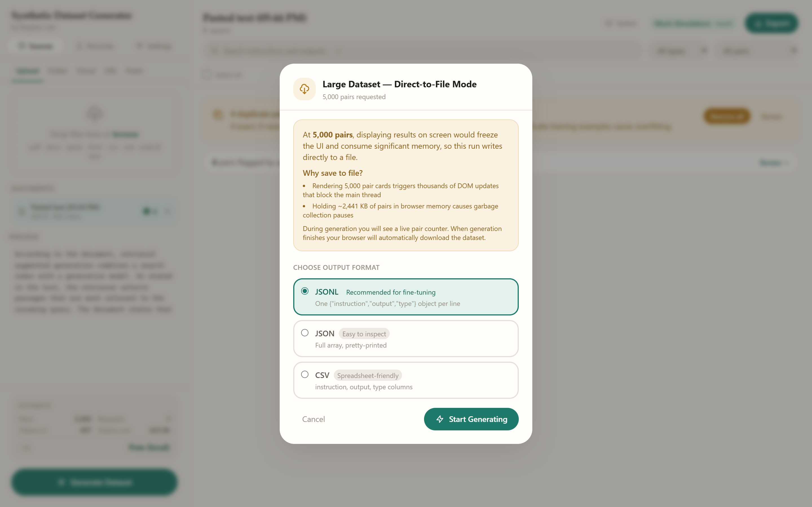

### Session persistence

Generation settings persist to `localStorage`; documents and generated pairs persist to IndexedDB. Reload the page and you are offered your previous session back instead of losing a long run.

### Resilience
- **Adaptive context retry** — a chunk that overflows the model's context window is halved and retried, up to three times, instead of failing the run
- **Retry failed chunks** — transient failures (rate limits, timeouts) are tracked so you can re-run only those chunks rather than paying to regenerate the whole dataset
- One failing file never aborts a multi-file batch

---

## Quick Start

### Prerequisites
- [Node.js](https://nodejs.org/) 18 or later
- npm (comes with Node)

### Install & run

```bash
git clone https://github.com/rbughao/SyntheticDataSet.git
cd SyntheticDataSet
npm install
npm run dev
```

Open [http://localhost:5173](http://localhost:5173).

To try it with no API key at all, select **Mock (Simulation)** as the provider — it generates pairs locally from your document text.

---

## Usage Guide

### 1 — Load documents

Pick a source tab:

- **Upload** — drag-and-drop or browse for individual files (a dropped folder works here too)
- **Folder** — choose a folder; every subfolder is included
- **Cloud** — a folder from a connected Google Drive or OneDrive account
- **URL** — fetch one page, or tick the box to crawl the site's links
- **Paste** — raw text straight into the box

Load as many as you like from as many sources as you like: everything queued is
processed when you hit Generate. Folder, Cloud and crawl imports pause at a
review step first.

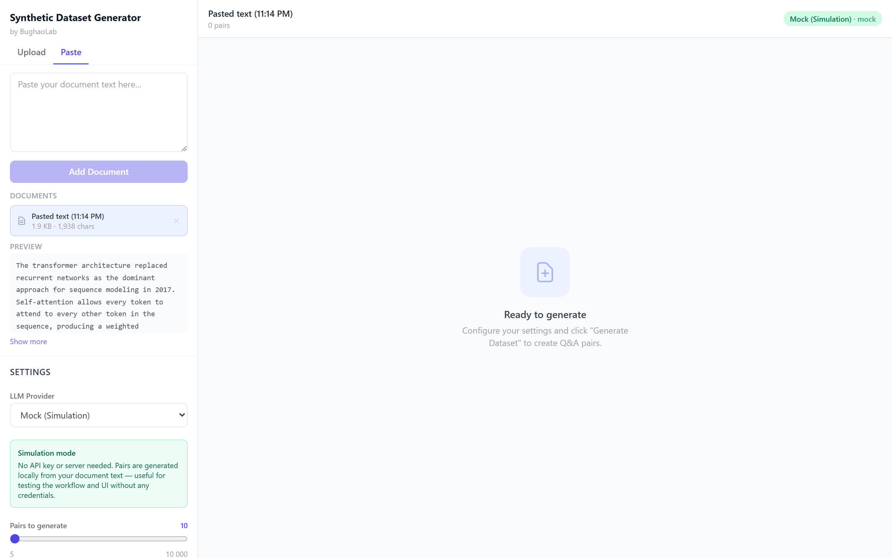

### 2 — Choose a provider

Pick a provider in **Settings** and enter your API key in the masked field. Keys are saved per provider on blur.

> **Note:** API keys are stored unencrypted in browser `localStorage`, which is readable by any script running on this origin. That is fine for a local tool; do not use this on a shared or untrusted machine.

### 3 — Configure generation

| Setting | Recommendation |
|---|---|
| Pair count | Start with 10–20 to check quality before scaling up |
| Style | "Factual Q&A" for reference material; "Instruction-following" for procedural content |
| Difficulty | Match your target model's expected capability |
| Temperature | "Balanced" suits most documents |
| Parallel requests | 3 for cloud APIs; 8–10 is safe for local Ollama |

Check the **Estimate** panel before generating — it tells you the cost and duration up front.

### 4 — Generate

Click **Generate Dataset**. All files and all their chunks feed one shared concurrency pool, so multiple documents process simultaneously. Sidebar badges track each file's status.

### 5 — Review

- **Search** to find specific pairs; **filter** by type, rating, flags, or duplicates
- Remove duplicates in one click if the banner appears
- Check anything flagged by quality validation
- **Edit**, **rate**, **regenerate**, or **delete** individual pairs

### 6 — Export

Click **Export**, choose a schema and format, optionally add a train/val split, and download. The modal previews the first record in your chosen schema so you can confirm the shape before committing.

---

## Provider Setup

| Provider | Notes |
|---|---|
| **Mock (Simulation)** | No API key needed — generates pairs locally. Good for testing the workflow |
| **Anthropic** | Requires a CORS proxy in the browser (see below) |
| **OpenAI** | Works directly from the browser |
| **Google Gemini** | Works directly from the browser |
| **Meta (Llama)** | Via Together.xyz, Fireworks AI, or Groq |
| **Chinese Open Weights** | Qwen (Alibaba DashScope) or DeepSeek |
| **Ollama** | Local models, zero cost |
| **Custom** | Any OpenAI-compatible endpoint (vLLM, LM Studio, etc.) |

### Google Gemini (easiest, no proxy)
1. Get an API key from [Google AI Studio](https://aistudio.google.com/)
2. Select **Google Gemini**, paste the key, pick a model

### OpenAI
1. Get an API key from [platform.openai.com](https://platform.openai.com/)
2. Select **OpenAI**, paste the key

### Anthropic (requires a CORS proxy)
Anthropic's API does not send `Access-Control-Allow-Origin` headers for browser requests.

**Option A — run a local proxy** that forwards to `https://api.anthropic.com` and
adds CORS headers, then set Proxy URL in Settings to its address:

```
http://localhost:8080
```

The app appends `/v1/messages` to whatever you enter, so the proxy should
forward that path straight through.

**Option B — use Google Gemini or Ollama instead** (no proxy needed).

### Ollama (free, local)
```bash
OLLAMA_ORIGINS=* ollama serve
ollama pull llama3.2
```
Select **Ollama (Local)**, keep the default base URL, and type `llama3.2` as the model.

### Custom / vLLM / LM Studio
Select **Custom (OpenAI-compatible)** and enter your base URL including `/v1`, e.g. `http://192.168.1.10:8000/v1`.

Use the **Test** button to verify connectivity and fetch available models. In dev mode all Custom and Ollama requests route through a built-in Vite CORS proxy, so browser CORS restrictions are handled transparently.

---

## Architecture

```
src/
├── index.css                      # Design tokens (light + dark), base styles
├── App.jsx                        # Central state, persistence, filtering, dnd wiring
├── components/
│   ├── DocumentPanel.jsx          # Upload, paste, document list with per-file status
│   ├── SettingsPanel.jsx          # Provider config, generation settings, connection test
│   ├── PreflightEstimate.jsx      # Cost / token / duration estimate
│   ├── GenerateButton.jsx         # Trigger, progress bars, cancel
│   ├── PairCard.jsx               # Editable Q&A card with quality + duplicate badges
│   ├── PersonasView.jsx           # Persona library: select, create, edit
│   ├── SidebarNav.jsx             # Sources / Personas / Settings views
│   ├── ThemeToggle.jsx            # Light / dark / system cycle
│   ├── CloudAccounts.jsx          # Connect / disconnect cloud sources
│   ├── CloudBrowser.jsx           # Pick a folder from a connected account
│   ├── IngestReview.jsx           # Selection + cost gate for bulk import
│   ├── VirtualPairList.jsx        # Windowed list for large datasets
│   ├── WorkspaceHeader.jsx        # Search, filters, bulk actions, export
│   ├── ExportModal.jsx            # Schema + format picker, split, live preview
│   └── LargeOutputModal.jsx       # Direct-to-file format picker (>1000 pairs)
├── hooks/
│   ├── useDocuments.js            # Document loading, parsing, restore
│   ├── useGenerate.js             # Chunk orchestration, concurrency pool, retry
│   ├── useCloudAuth.js            # Cloud connection state
│   ├── useTheme.js                # Theme state, persistence, OS sync
│   ├── useKeyboardShortcuts.js    # Global shortcut bindings
│   └── useExport.js               # Schema conversion + serialization
├── providers/
│   ├── LLMProvider.js             # Abstract base class
│   ├── OpenAICompatibleProvider.js  # Shared OpenAI-format adapter
│   ├── AnthropicProvider.js
│   ├── OpenAIProvider.js
│   ├── GoogleProvider.js
│   ├── MetaProvider.js
│   ├── ChineseOpenWeightsProvider.js
│   ├── OllamaProvider.js
│   ├── CustomProvider.js
│   ├── MockProvider.js            # Offline simulation (no network)
│   └── index.js                   # Provider registry + factory
├── sources/
│   ├── exclusions.js              # Secret / noise / unsupported filtering
│   ├── cloudProviders.js          # Drive / OneDrive endpoints + client IDs
│   ├── crawler.js                 # Same-origin crawl, robots.txt, dedupe
│   ├── googleDriveSource.js       # Drive listing + native-format export
│   ├── oneDriveSource.js          # Graph listing + pre-signed download
│   ├── oauth.js                   # Authorization Code + PKCE popup flow
│   ├── folderSource.js            # Recursive folder + drag-drop walking
│   └── urlSource.js               # URL fetch → File, with URL validation
└── utils/
    ├── chunker.js                 # Semantic-boundary document splitter
    ├── personas.js                # Preset points of view + prompt fragment
    ├── promptBuilder.js           # System + user prompt construction
    ├── parser.js                  # 4-strategy JSON extraction from LLM output
    ├── fileReader.js              # PDF / DOCX / TXT / MD parsing
    ├── pricing.js                 # Model price table + run estimation
    ├── dedup.js                   # Exact + trigram duplicate detection
    ├── quality.js                 # Pair validation heuristics
    ├── storage.js                 # localStorage settings + IndexedDB session
    └── corsProxy.js               # Dev-mode CORS proxy wrapper for fetch
```

### Chunking and parallelism

Documents longer than 4,000 characters are split at semantic boundaries — paragraph, then sentence, then word, then a hard cut as a last resort — with 300 characters of overlap so context straddling a boundary is not lost. The requested pair count is distributed evenly across chunks.

Every chunk from every document is flattened into **one shared concurrency pool**. Files therefore process simultaneously rather than one after another, which for a multi-file batch is substantially faster than sequential processing. Accuracy is unaffected: each API call is a self-contained prompt containing only that chunk's text, so the model has no cross-call or cross-file state.

JavaScript is single-threaded, so this is async I/O concurrency, not OS threading — which is the right tool here, because the bottleneck is waiting on network responses rather than CPU work.

### CORS proxy (dev mode)

A Vite plugin in `vite.config.js` registers middleware at `/api/cors-proxy`. In development, `corsProxy.js` sends requests to the local Vite server with the real target in an `x-proxy-target` header; the middleware forwards them server-side using Node's `http`/`https` (forcing IPv4, which avoids a `localhost` → `::1` mismatch on Windows) and returns the response. This makes any OpenAI-compatible server work without touching its CORS configuration.

Production builds fall back to direct `fetch`.

---

## Building for Production

```bash
npm run build
npx serve dist
```

Note: the CORS proxy is a dev-server feature only. For production deployments using Custom or Ollama providers, the target server must send `Access-Control-Allow-Origin: *`.

---

## Testing

There are no unit tests. Every suite drives the real app in headless Chrome
against generated fixtures, because the interesting failures here live in
browser behaviour — file inputs, `DOMParser`, ZIP readers, redirects — not in
pure functions.

```bash
npm run dev              # in one terminal, then any of:
npm run test:filetypes
npm run test:sources
npm run test:crawl
npm run test:cloud
npm run test:personas
```

| Suite | Checks | Covers |
|---|---|---|
| `test:filetypes` | 12 | One fixture per format, uploaded through the real file input |
| `test:sources` | 46 | Folder and URL import, plus every exclusion rule |
| `test:crawl` | 33 | A local fixture site built to break naive crawlers |
| `test:cloud` | 36 | Drive and OneDrive adapters against a stubbed API |
| `test:personas` | 35 | Persona resolution, prompt injection, cost multiplier, tagging |

Each suite targets the cases that actually bite:

- **`test:filetypes`** — HTML noise stripping, CSV column labelling, EPUB spine ordering (the fixture's spine deliberately contradicts filename order), PPTX numeric slide ordering, plus the empty-extraction and unsupported-type guards.
- **`test:sources`** — every exclusion rule against synthetic paths, a folder selection driven through the real React handler, and a live URL fetch through the proxy. It also pins URL parsing: `ftp://` is rejected rather than coerced, `host:port` is not mistaken for a scheme, and credentials in a URL are refused.
- **`test:crawl`** — starts a local fixture site containing a cycle, an off-origin link, a `robots.txt` `Disallow`, a `noindex` page, tracking params disguising one page as many, and a non-HTML file, then runs the real crawler against it.
- **`test:personas`** — checks that editing a preset stores an override without mutating the shipped default and that generation picks the edit up, that pairs actually split across the selected personas, that the point of view reaches the prompt (including the two guardrails), that the estimate multiplies requests correctly, and that generated pairs carry their persona through to the badge and filter.
- **`test:cloud`** — stubs `fetch` with a fake Drive and Graph API, so it tests this app's logic (pagination, recursion, native-format export, download routing, exclusions on cloud items) rather than the providers'.

**Not automated:** the OAuth consent flow. It needs a real client ID and account, so everything up to and including the token request is tested, but a live sign-in is not.

---

## Regenerating the screenshots

The images in this README are produced from the running app by a script, so they stay in sync with the UI:

```bash
npm run dev            # in one terminal
npm run screenshots    # in another
```

It drives headless Chrome via `puppeteer-core` using the Mock provider, so no API key or network access is needed. Set `CHROME_PATH` if Chrome is not at the default Windows location, or `APP_URL` if the dev server is on another port.

---

## Tech Stack

| Library | Purpose |
|---|---|
| React 18 | UI framework |
| Vite 5 | Dev server, bundler |
| Tailwind CSS 3 | Styling |
| @dnd-kit | Drag-and-drop reordering |
| react-window | List virtualization for large datasets |
| pdfjs-dist 4 | PDF text extraction |
| mammoth | DOCX text extraction |
| jszip | EPUB / PPTX archive reading |
| puppeteer-core | Screenshots and the test suites (dev only) |

Three things deliberately have **no** dependency:

- **HTML and XML parsing** uses the browser's built-in `DOMParser`
- **Theming** is plain CSS variables consumed through Tailwind — no runtime theming library
- **OAuth** is Authorization Code + PKCE implemented directly, rather than pulling in Google Identity Services and MSAL for one flow each

---

## License

MIT
